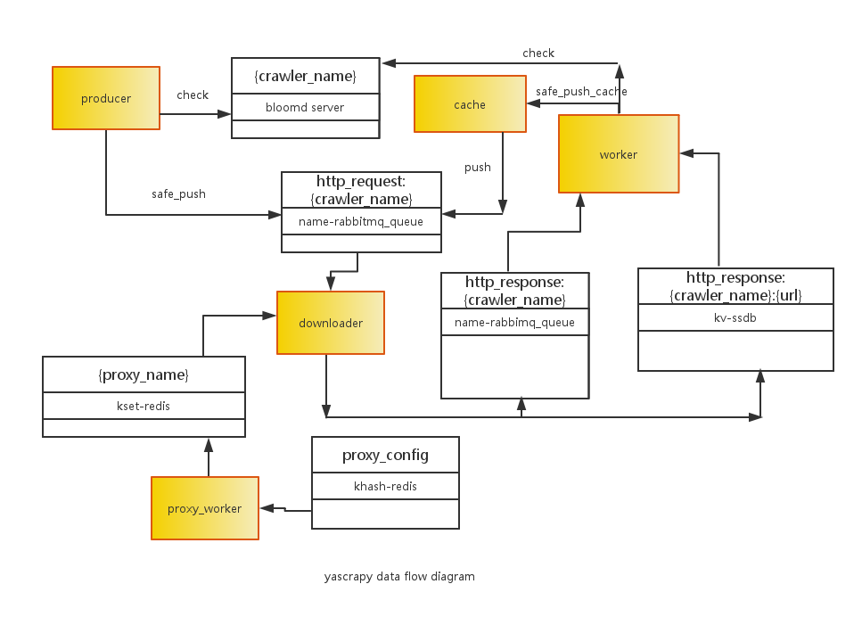

# Getting Started

Yascrapy is deigned to be flexible and small web crawling framework and has been used to crawl many sites including weibo, github, stackoverflow on production environment.

 
    
From the above diagram, yascrapy use some components to store the crawled web pages, request messages, crawled links, proxies. 

The producer componet put initial links into the http_request queue on rabbitmq server. 

Then downloader component consume request message and send web requests constantly and put the crawled web pages into the http_response queue on ssdb server and put the crawled link on rabbitmq http_response queue as the key to index the content on ssdb. Yascrapy takes high-performance seriously and use golang to develop this downloader component, see here: yascrapy-downloader.

The proxy_worker component get proxies from proxy web server. And it stores proxies on redis server, add  and check proxies with specified time interval. This service is written with golang, see here: yascrapy-downloader.

The worker component parse the page content on ssdb and put the structed data into database (default to mongo). Instead of getting response content directly from ssdb, worker consume the response key on rabbitmq and get data from ssdb indexed by the key. In addition, the worker component put new request messages to cache component.

The cache component stores new request messages on ssdb. We add this component to control the rabbitmq publisher speed. 
If rabbitmq queue have too many messages, the whole system is not stable and have performance problem.

To avoid crawling links repeatedly, crawler need store the crawled links. Yascrapy use bloomd to do this job and  check whether crawler have crawled the gived link.

Yascrapy config file use json format, including common.json, core.json, proxy.json, sample config files are in `yascrapy/conf` directory. Indeed, config file is matched to each component. `core.json` is used by the downloader component, `proxy.json` is used by the proxy component and `common.json` is used by worker component, producer component, ect.

Yascrapy have some admin tools to operate on yascrapy components, in `yascrapy/tools` directory.

    
to test install ok, simply do 

    >>> python setup.py test

to run yascrapy sample producer, simply do
    
    >>> yascrapy_producer -n sample_spider
    
to run yascrapy sample worker, simply do

    >>> yascrapy_worker -n sample_spider --test

If you want to write you first spider, have a look at the `yascrapy/sample_spider` directory.

